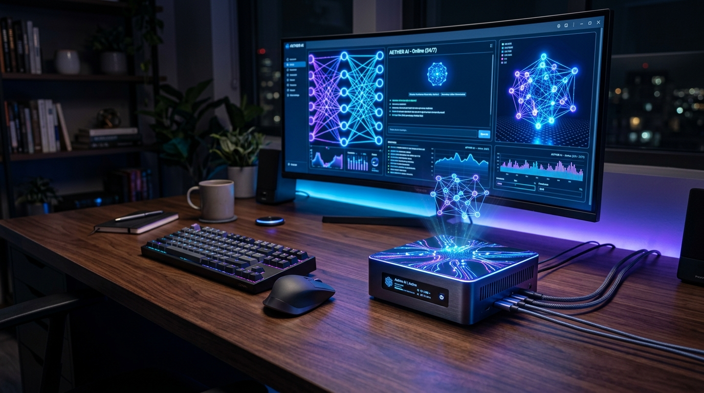
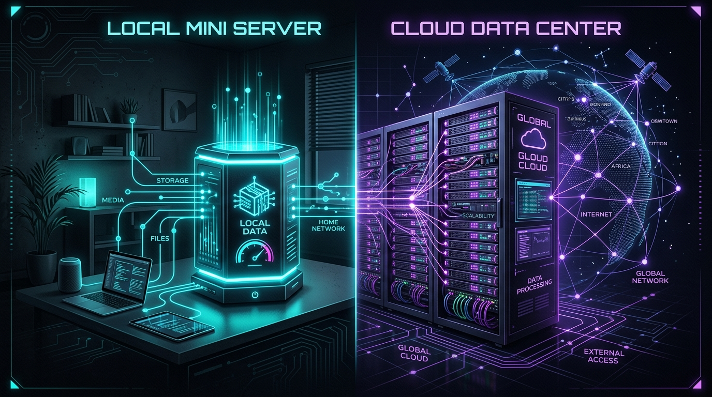
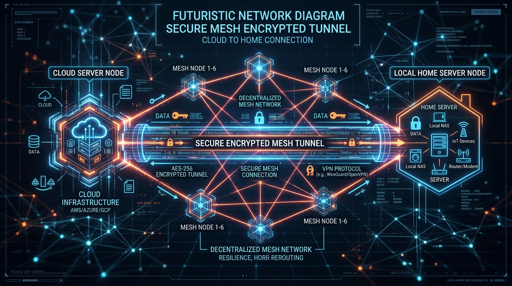

# Osobní AI asistent běžící 24/7: Domácí mini server vs. cloudové VPS

> **Sekce:** Aktuality  
> **Datum:** 5. srpna 2026  
> **Téma:** Architektura a infrastruktura pro osobního AI asistenta  



Představte si asistenta, který pro vás pracuje nepřetržitě 24 hodin denně, 7 dní v týdnu. Zatímco spíte, zpracovává rešerše, hlídá důležité aktualizace, řídí plánované úlohy, spravuje notifikace a reaguje na vaše požadavky. Aby však takový autonomní AI asistent mohl spolehlivě fungovat bez neustálých výpadků, potřebuje správně dimenzovanou infrastrukturu.

Při návrhu architektonického řešení narazíte na dvě základní filosofie: **provozovat vlastního asistenta doma na mini serveru**, nebo **využít cloudové VPS (Virtual Private Server)**.

V tomto článku si detailně rozbereme prvních 5 klíčových oblastí – od důvodů pro 24/7 provoz až po pokročilou **hybridní architekturu**, která propojuje to nejlepší z obou světů.

---

## 1. Úvod: Od jednorázového chatu k neustále běžícímu agentovi

Většina uživatelů dnes používá generativní umělou inteligenci reaktivně – otevřou webové rozhraní (např. ChatGPT nebo Google Gemini), napíší dotaz, přečtou si odpověď a okno zavřou. 

Skutečný posun v produktivitě ale nastává ve chvíli, kdy přeorientujete svůj model fungování z **pasivního chatu na autonomního agenta**:

* **Proaktivní monitoring a notifikace:** Asistent nemusí čekat na váš impuls. Samostatně kontroluje API rozhraní, e-mailové schránky, kalendáře nebo stav vašich systémů a odesílá vám souhrnné zprávy přes Telegram či Signal v momentě, kdy se stane něco důležitého.
* **Asynchronní plnění dlouhotrvajících úloh:** Místo toho, abyste sledovali načítací indikátor při generování rozsáhlých rešerší nebo analýze dat, zadáte úkol a asistent vás informuje o dokončení.
* **Nepřetržitý běh plánovaných skriptů (Cron / Timery):** Noční zálohy, agregace zpráv z RSS kanálů, pravidelné generování reportů nebo údržba databáze probíhají bez nutnosti mít zapnutý váš pracovní notebook.

Aby tato mechanika fungovala 24 hodin denně 7 dní v týdnu, musíte vyřešit kardinální otázku: **Kde bude srdce vašeho AI asistenta fyzicky běžet?**

---

## 2. Domácí mini server: Absolutní soukromí, vysoký lokální výkon a plná kontrola

Provoz na vlastním hardwaru (tzv. *Homelab*) představuje volbu pro ty, kteří vyžadují nekompromisní ochranu soukromí a chtějí vytěžit maximum z otevřených lokálních modelů.

### Hardwarové možnosti pro rok 2026:
1. **Ekonomický základ (Intel N100 / N97 / N305 Mini PC):**
   * **Spotřeba:** Pouhých 6 až 15 W v zátěži (provoz stojí cca 30–80 Kč měsíčně).
   * **Využití:** Perfektní pro běh Docker kontejnerů, řídicí logiky v Pythonu/Node.js, databází (PostgreSQL/Redis) a lehčích úloh. Pro velké LLM modely však chybí dedikovaný grafický výkon.
2. **Výkonný standard pro lokální AI (Apple Mac Mini M-Series / M4):**
   * **Unifikovaná paměť (RAM):** Klíčová vlastnost Apple Silicon. Verze s 24 GB nebo 48 GB unifikované paměti s propustností přes 150 GB/s dokáže plynule spouštět lokální 8B až 32B modely (Llama 3, Qwen, Mistral) přes rozhraní **Ollama** nebo **LM Studio** rychlostí 30–60 tokenů za sekundu.
   * **Spotřeba:** Kolem 5–10 W při nečinnosti, cca 30–40 W v plné zátěži při inferenci.
3. **NVIDIA Dedicated GPU Rig:**
   * Počítač vybavený kartami jako RTX 3090 / 4090 (24 GB VRAM). Nabízí maximální rychlost inference, avšak za cenu vyšší spotřeby v idle stavu (30–60 W) a hlučnosti.

### Hlavní výhody domácího serveru:
* **100% soukromí a datová suverenita:** Vaše osobní soubory, privátní API klíče, deníky a konverzace nikdy neopustí vaši místní síť.
* **Nulové poplatky za tokeny:** Při spouštění lokálních LLM neplatíte žádnému poskytovateli za tisíce přenesených tokenů.
* **Široká multifunkčnost:** Mini server zvládá zároveň spouštět Home Assistant pro chytrou domácnost, lokální NAS, Plex/Jellyfin nebo blokovač reklam Pi-hole.

### Rizika a úskalí:
* **Výpadky infrastruktury:** Pokud u vás doma vypadne elektrický proud nebo optický/VDSL internet, váš asistent přestane reagovat.
* **Složitější vzdálený přístup:** K přístupu na domácí server z mobilu na cestách potřebujete bezpečně nastavené tunelování.
* **Počáteční investice:** Kvalitní Mini PC vyjde na 5 000 – 12 000 Kč, Mac Mini na 17 000 – 35 000 Kč.

---

## 3. Cloudové VPS: Giga-stabilita 99,9 %, veřejná IP a zero-maintenance

Pokud se nechcete starat o hardware, prach, chlazení a výpadky domácího připojení, cloudové virtuální servery (VPS) nabízejí profesionální prostředí dostupné za pár minut.

### Typičtí poskytovatelé a konfigurace:
* **Poskytovatelé:** Hetzner Cloud, DigitalOcean, Linode (Akamai), OVH nebo český VPS Free.
* **Typická konfigurace:** 2 až 4 vCPU (AMD EPYC / Intel Xeon), 4 až 8 GB RAM, 40–80 GB NVMe SSD.
* **Cena:** Cca 4 € až 10 € měsíčně (cca 100–250 Kč/měsíc).

### Architektonický kontext běhu na VPS:
Na levném VPS obvykle **neběží samotný obří LLM model** (grafické VPS s NVIDIA GPU stojí desítky až stovky eur měsíčně). Místo toho VPS slouží jako **mozek řídicí logiky**:
* Běží zde orchestrovací skripty (n8n, LangChain, LlamaIndex, vlastní Python agenti).
* Dotazy na jazykové modely se směrují přes bleskurychlá API rozhraní (Google Gemini API, Claude API, OpenAI API).

### Hlavní výhody VPS:
* **Garantovaná spolehlivost (Uptime 99,9 %+):** Profesionální datacentra s dieselgenerátory a zálohovanými optickými trasami. Váš asistent pobeží bez přerušení.
* **Statická veřejná IPv4/IPv6 adresa:** Triviální nastavení webhooků pro Telegram boty, Discord, GitHub akce či přijímání e-mailů.
* **Blesková konektivita:** Páteřní síť s rychlostí 1–10 Gbps zajišťuje odezvy v řádu milisekund.
* **Bez starostí o fyzický HW:** V případě selhání uzlu provider automaticky přemístí vaši instanci jinam.

### Nevýhody VPS:
* **Opakující se měsíční náklad:** Měsíční fakturace, která s časem stoupá (zvláště při započtení spotřeby cloudových API).
* **Limity pro lokální AI:** Bez drahé GPU nelze na VPS plynule provozovat vlastní 13B+ LLM modely.
* **Bezpečnostní riziko třetí strany:** Vaše data a API klíče jsou uloženi na serveru vzdáleného poskytovatele.

---



## 4. Přehledné srovnání (Tabulka parametrů)

Pro jasnou představu porovnejme obě řešení podle nejdůležitějších kritérií:

| Kritérium / Parametr | Domácí Mini Server (Intel N100 / Mac Mini) | Cloudové VPS (např. Hetzner) |
| :--- | :--- | :--- |
| **Spolehlivost provozu (Uptime)** | 95–98 % (závisí na domácí síti a UPS) | **99,9 %+ (Datacentrum s redudancí)** |
| **Ochrana soukromí a dat** | **100 % lokální (data neopustí dům)** | Data uložena na cloudu třetí strany |
| **Běh lokálních LLM (Ollama)** | **Vynikající** (zvláště s Mac Mini M-series) | Velmi pomalý (chybí GPU v základu) |
| **Využití Cloudových API** | Možné (přes domácí internet) | **Bleskové (páteřní konektivita)** |
| **Počáteční investice (CAPEX)** | 5 000 – 30 000 Kč (hardware) | **0 Kč** |
| **Měsíční provozní náklady (OPEX)** | Nízké (jen elektřina ~40–150 Kč/měs.) | Paušál (~100–300 Kč/měs. + API) |
| **Veřejná IP a Webhooky** | Nutné tunelování / DDNS / Cloudflare | **Nativní veřejná IP adresa** |
| **Náročnost na správu HW** | Musíte řešit prach, teplo, výpadky | **Nulová (stará se poskytovatel)** |

---

## 5. Šalamounské řešení: Hybridní model (VPS + Domácí server přes Tailscale)

Dostáváme se k nejsilnějšímu architektonickému vzoru, který kombinuje výhody obou předchozích světů a eliminuje většinu jejich nevýhod.



### Jak hybridní model funguje?

```
[ Uživatel / Telegram / Webhook ]
               │
               ▼
┌──────────────────────────────┐
│  Cloudové VPS (Hetzner)      │  <-- Běží 24/7, má veřejnou IP,
│  (Veřejná brána a router)    │      přijímá zprávy a webhooky
└──────────────┬───────────────┘
               │ (Šifrovaný tunel přes Tailscale Mesh VPN)
               ▼
┌──────────────────────────────┐
│  Domácí Mini Server / Mac    │  <-- Běží lokální LLM (Ollama),
│  (Těžký dělník & Soukromí)   │      má přístup k lokálním datům
└──────────────┬───────────────┘
```

1. **VPS v cloudu jako „Brána 24/7“:** 
   Nejlevnější VPS (za cca 100 Kč/měsíčně) vystupuje do internetu se statickou IP adresou. Přijímá příchozí zprávy z Telegramu, e-mailů či webhooků. Zajišťuje, že uživatel dostane odpověď i ve chvíli, kdy je domácí síť nedostupná.

2. **Domácí server jako „Dělník a Soukromé úložiště“:**
   Na domácím Mini PC nebo Macu Mini běží náročné lokální modely (Ollama), vektorové databáze a soukromé dokumenty. 

3. **Bezpečné propojení přes Tailscale (WireGuard Mesh VPN):**
   Oba servery jsou propojeny pomocí bezplatné virtuální sítě **Tailscale**. 
   * Nemusíte otevírat žádné porty na domácím routeru ani kupovat veřejnou IP od poskytovatele internetu.
   * Spojení je end-to-end šifrované.
   * VPS může posílat dotazy domácímu serveru přes privátní IP adresu (např. `100.x.y.z`).

4. **Automatický Fallback (Záložní plán):**
   Pokud doma vypadne proud nebo internet, VPS detekuje nedostupnost domácího serveru a dočasně přesměruje požadavky na cloudové API (např. Google Gemini API). Jakmile se domácí server vrátí online, VPS automaticky přepne výpočty zpět domů.

---

## 6. Rozhodovací matice: Co je nejlepší volbou právě pro vás?

Abychom vám usnadnili volbu správné architektury, připravili jsme praktickou rozhodovací matici podle vašich priorit a technických možností:

| Vaše hlavní priorita / Situace | Doporučená architektura | Hlavní důvod |
| :--- | :--- | :--- |
| **„Chci to mít co nejrychleji a bez starostí o hardware.“** | **Cloudové VPS** | Během 10 minut máte spuštěný server s 99,9% uptime a veřejnou IP. |
| **„Moje data jsou citlivá a nesmí opustit dům.“** | **Domácí Mini Server** | Plná kontrola nad daty i lokálními AI modely (Ollama) bez třetích stran. |
| **„Chci využívat lokální LLM (8B–32B) na max.“** | **Mac Mini M-series** | Unifikovaná RAM s obří propustností nabízí nejlepší poměr cena/výkon pro inferenci. |
| **„Potřebuji 100% dostupnost botů + sílu domácího HW.“** | **Hybridní model (VPS + Tailscale)** | VPS zajistí 24/7 přijímání zpráv a fallback, domácí PC náročné výpočty. |
| **„Mám minimální rozpočet na startu.“** | **Levné VPS (např. Hetzner za ~100 Kč/měs.)** | Nulové počáteční investice do HW, platíte jen nízký měsíční paušál. |

---

## Shrnutí a závěr článku

Přechod od občasného chatování s AI k **osobnímu AI asistentovi běžícímu 24/7** je jedním z největších skoků v osobní produktivitě. Výběr správné infrastruktury závisí na tom, kde leží vaše prioritní váhy mezi **soukromím, spolehlivostí a násobnou investicí**.

### Hlavní myšlenky na závěr:
1. **Jednoduchost vítězí na startu:** Pokud s 24/7 AI agenty teprve začínáte, začněte na cloudovém VPS. Umožní vám rychle vyladit logiku a funkce asistenta bez řešení hardwarových úskalí.
2. **Lokální výkon pro náročné:** Jakmile začnete pracovat s citlivými daty nebo objemnými prompty, investice do domácího mini serveru (např. Mac Mini či Intel N100) se vám velmi rychle vrátí na ušetřených poplatcích za cloudová API.
3. **Hybridní model je budoucnost:** Propojení cloudové dostupnosti s lokální výpočetní sílou přes bezpečné VPN (Tailscale) představuje zlatý standard pro moderní osobní automatizaci.

Ať už zvolíte jakoukoliv cestu, klíčové je začít v malém a architekturu postupně rozvíjet podle toho, jak rostou nároky vašeho digitálního pomocníka.

---

*Máte již zkušenosti s provozem vlastního AI asistenta? Používáte lokální modely přes Ollama, nebo spoléháte na cloudová API? Napište nám své zkušenosti a dotazy do diskuse pod článkem!*
